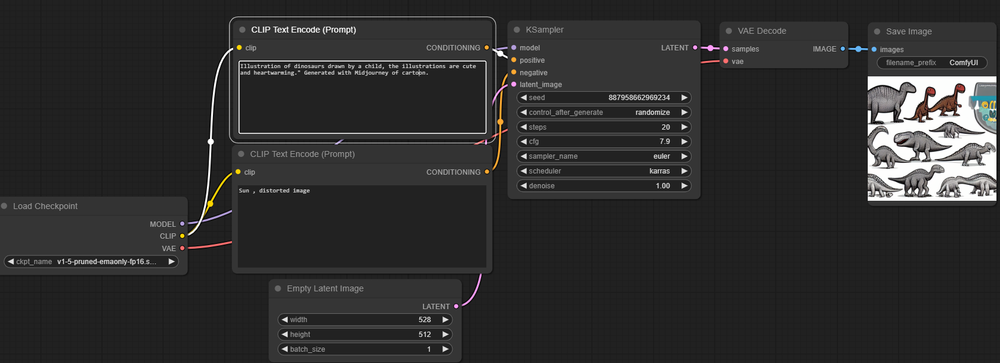

# Image-generation-Using-Stable-diffusion-and-ComfyUI
This project is part of the Edunet AICTE Tekshsaksham foundation initiative and focuses on AI-driven image generation using Stable Diffusion with ComfyUI.

# Overview
Stable Diffusion is a state-of-the-art deep learning model used for AI-generated images.The pre-trained diffusion models required to generate high-quality images. These models can be obtained from the Hugging Face model hub or from open-source repositories.

ComfyUI provides a graphical user interface that allows users to create complex workflows for generating, modifying, and enhancing images.The primary software used to build and experiment with custom workflows for image generation. 

## Project Goals
Implement and experiment with Stable Diffusion models for generating high-quality images.
Utilize ComfyUI for an interactive and node-based workflow to customize image outputs.
Explore fine-tuning, control mechanisms, and image-to-image generation

### functionalities :
1. Load Checkpoint :: Loads the Stable Diffusion model checkpoint (.ckpt or .safetensors) into memory.
2. CLIP Text Encode (Prompt - Positive & Negative) : Converts the input text into a machine-readable format for guiding image generation.
3. Empty Latent Image : Creates a blank latent space (random noise) of a specific resolution. This serves as the starting point for generating the image.
4. K-Sampler : The core of the Stable Diffusion denoising process.Gradually removes noise over multiple steps to form an image.
5. VAE Decode (Variational Autoencoder Decode) : Converts the processed latent representation into a RGB image.The decoder reconstructs the final visual output from the latent space.
6. Image : Displays the final AI-generated image.After decoding and processing, the image is ready for saving or further modifications.

## Output 

